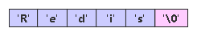
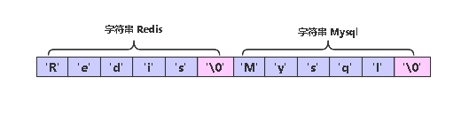
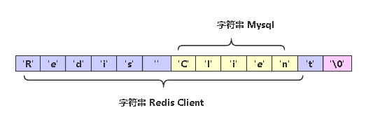
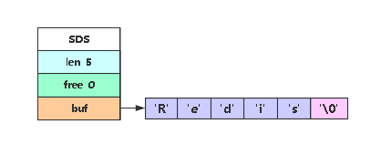
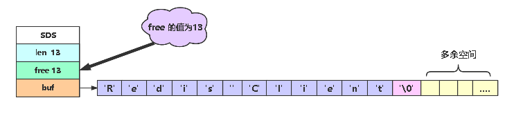
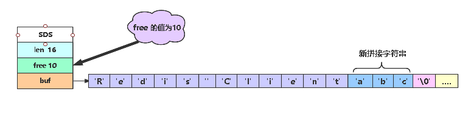
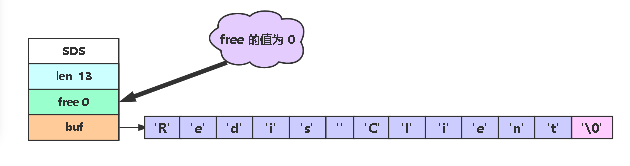
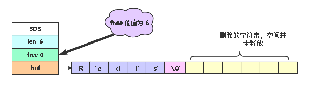
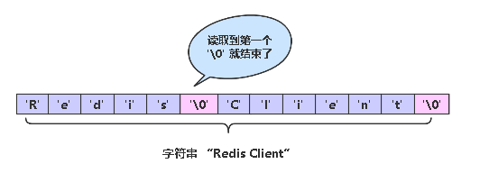
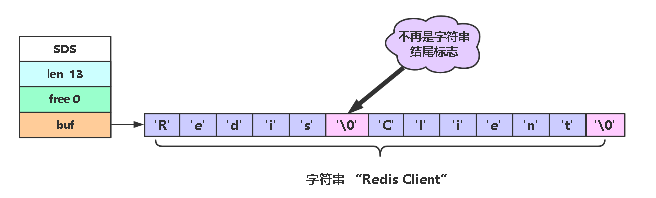

我们知道，Redis 支持字符串、哈希、列表、集合和有序集合五种基本类型。那么我们如何把图片、音频、视频或者压缩文件等二进制数据保存到 Redis 中呢？之前在使用 Memcached 缓存这类数据时是把它们转换成 Base64 字符串后再进行保存的。在 Redis 中也可以使用同样的方式，但是，Redis 中的 字符串是支持直接存储二进制数据的，那么我们就聊聊他是如何实现的？

### 简单动态字符串 ( SDS )

Redis 是使用 C 语言编写的，但是，Redis 没有直接使用 C 语言自有的字符串类型，而是自己构建了一个称为**简单动态字符串 ( simple dynamic string, SDS  )** 的抽象类型。你可能会有个疑惑，Redis 为什么要构建自己的 SDS，而不适用 C 语言自有的字符串？SDS 长什么样？使用 SDS 又有什么优点呢？

### C 语言中的字符串

C 语言中传统字符串是使用长度为 N+1 的字符数组来表示长度为 N 的字符串，并且字符串数组的最后一个元素总是空字符 `'\0'`。如下所示：



C 语言中的这种简单的字符串表示方式，不能满足 Redis 对字符串在安全性、效率以及功能方面的要求，所以 Redis 自己构建了字符串表示方式 SDS。

### SDS 的定义

在 Redis 源码文件 sds.h 中定义了 SDS 的结构，如下所示：

```c
struct sdshdr {
    // 记录 buf 数组中已使用的数量
    unsigned int len; 
    // 记录 buf 中未使用的空间数量
    unsigned int free; 
    // 字符数组，用于保存字符串
    char buf[];  
};
```

有上面的源码，我们看到 SDS 中也是使用字符数组来存放字符串，但是，它是通过 属性  len 来表示当前字符串的长度。

### SDS 与 C 字符串的区别

接下来我们就通过对比 SDS 和 C 字符串的区别，来说明为什么 Redis 需要构建 SDS，而不使用 C 字符串？ 

**1、获取字符串长度的复杂度**

因为 C 字符串不记录自身的长度，所以在获取一个 C 字符串的长度时，需要遍历整个字符数组，对遇到的每个字符进行计数，知道遇到代表字符串结尾的空字符串`'\0'` 为止，那么，这个操作的复杂度为 O(N)。

上面的 SDS 结构的源码，我们可知，SDS 字符串通过 len 记录了当前字符串的长度，那么当获取 SDS 的字符串长度的复杂度仅为 O(1)。这就确保了获取字符串长度的工作不会成为 Redis 的性能瓶颈，因为不管字符串多长，其获取长度的复杂度都是O(1)。这或许也是 Redis 快的一个原因吧。

**2、杜绝缓冲区溢出**

我们在日常  Java 开发中，经常会用到字符串的拼接，在 C 语言 和 Redis 中也经常用到字符串的拼接。由于 C 字符串不记录自身长度，这样就带来了一个问题就是，如果在拼接字符串时，如果内存计算不当，就会造成缓冲区溢出。如下所示：

开始为 相邻着的字符串 “Redis” 和 “Mysql” 



假如，我们把 “Redis” 改为 “Redis Client”，但忘记了重新分配内存，就会导致如下所示的结果。



可以看到，我们修改 “Redis” 字符串时，无意导致 把 “Mysql” 字符串的位置给占了，导致数据污染。那么 Redis 的 SDS 字符串是如何解决的呢？

由 SDS 的结构我们可知，SDS  有 `len`   存储了当前长度，还有 `free`  存储了未使用的长度，这样就简单多了，当操作字符串拼接时，可以先判断一下 `free` 和需要拼接的字符串，是否能够存的下，如放的下则直接执行，如果放不下，则进行扩容操作。

**3、减少修改字符串时带来的内存分配次数**

正如我们前面介绍的，因为 C 字符串底层是字符串数组，每次创建总是一个 N+1 个字符长的数组( 额外的一个字符空间用于保存空字符，这也是一个坑)。

Redis 是个高性能的内存数据库，如果需要对字符串进行频繁的拼接和截取操作，如果我们忘了重新分配空间，就会造成缓冲区溢出。

因为内存重分配涉及复杂的算法，并且可能需要执行系统调用，所以它通常是一个比较耗时的操作，在 Redis 这种对于速度要求严苛，数据频繁修改的数据库中，这种耗时操作是应该避免的。

Redis 为了避免 C 字符串的这种缺陷，SDS 通过未使用空间解除了字符串长度和底层数组长度之间的关联，SDS实现了空间预分配和惰性空间释放两种优化策略，去达到性能最大化，空间利用最大化：

- 空间预分配

  当对 SDS 进行修改，并且需要进行空间扩展操作的时候，Redis 程序不仅会为 SDS 分配修改所必须要的空间，并且根据特定的公式，分配额外的空间，这样就可以避免我们连续执行字符串添加所带来的内存分配消耗。

  比如有如下字符串：

  

  我们执行拼接函数，将SDS的长度修改为13字节，并将SDS的未使用空间同样修改为13字节

  

  如果我们在拼接字符串"abc", 长度为 9 小于 free 的值13，所以无需再次执行空间分配操作。

  

- 空间惰性释放

  刚才说到了分配空间时，会预分配多余的空间，你可以会问这个会不会导致内存泄露呢？这个无需担心，当我们执行完一个字符串缩减的操作，Redis 并不会马上收回我们的空间，因为可以预防你继续添加的操作，这样可以减少分配空间带来的消耗，但是当你再次操作还是没用到多余空间的时候，Redis 也还是会收回对于的空间，防止内存的浪费的。

  比如我们有如下字符串：

  

  我么截取字符串，删除“ Client”，结果如下，我们注意，删除字符串的空间并没有删除，如果后续还是用就可以继续使用，不用再次分配空间，如果不使用了，调用函数删除即可。

  

**4、二进制安全**

我们上文提的 C 字符串中是以空字符 '\0' 来表示 C 字符串的终止符号。这样字符串里就不能包含空字符，否则最先被读入的空字符将被误认为字符串传结尾，这些限制使得 C 字符串只能保存文本数据，而不能保存像图片、音频、视频、压缩文件等这样的二进制数据。如下所示：



在 Redis 中 SDS 中就不存在此问题，因为在 SDS 中通过 `len`  属性保存了字符串的长度，所以，在 SDS 中是通过 `len`  属性的值而不是空字符来判断字符串的是否结束。上图使用 SDS 存储如下所示：



通过使用二进制安全的 SDS，而不是 C 字符串，使得Redis不仅可以保存文本数据，还可以保存任意格式的二进制数据。

### 总结

Redis 通过自构建 SDS，而不使用 C 字符串，不仅解决了 C 字符串存在的缓冲区溢出问题，同时，还通过减少因修改字符串导致的频繁分配内存空间和获取长度导致的性能消耗。再者，由于 SDS 不再使用空字符 `'\0'` 标志字符串的结尾，使得 Redis 不但可以存储文本数据，还可以保存任意格式二进制数据。
